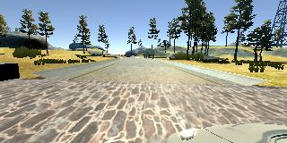
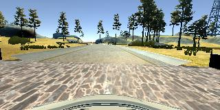

# **Behavioral Cloning** 

* Keras template taken from https://keras.io/getting-started/sequential-model-guide/


## Writeup

**Behavioral Cloning Project**

The goals / steps of this project are the following:
* Build, a convolution neural network in Keras that predicts steering angles from images
* Train and validate the model with a training and validation set
* Collect new data using the simulator to cover any weak spots the previous dataset had
* Train and validate the final model
* Test that the model successfully drives around track one without leaving the road
* Summarize the results with a written report

## Rubric Points
### Here I will consider the [rubric points](https://review.udacity.com/#!/rubrics/432/view) individually and describe how I addressed each point in my implementation.  

---
### Files Submitted & Code Quality

#### 1. Submission includes all required files and can be used to run the simulator in autonomous mode

My project includes the following files:
* model.py containing the script to create and train the model
* drive.py for driving the car in autonomous mode
* model.h5 containing a trained convolution neural network 
* writeup_report.md or writeup_report.pdf summarizing the results

#### 2. Submission includes functional code
Using the Udacity provided simulator and my drive.py file, the car can be driven autonomously around the track by executing 
```sh
python src/drive.py models/model.h5
```

#### 3. Submission code is usable and readable

The model.py file contains the code for training and saving the convolution neural network. The file shows the pipeline I used for training and validating the model, and it contains comments to explain how the code works.

### Model Architecture and Training Strategy

#### 1. An appropriate model architecture has been employed

My model consists of a convolution neural network, mimicking the LeNet architecture as provided in the course videos. While I have devised more complicated architectures, in the end the end result was determined by the data quality.

The final network architecture is as follows:
* A cropping layer to crop 50 pixels from the top and 20 from the bottom of each image. Effectively, this reduces the image dimensions (x, y) from (320, 160) to (250, 160).
* A normalization layer that squeezes all values to the range [-0.5, 0.5].
* A convolutional layer with 32 filters of shape 3x3 and a stride of 1.
* A 2x2 max-pooling layer.
* A convolutional layer with 32 filters of shape 3x3 and a stride of 1.
* A 2x2 max-pooling layer.
* A densely connected layer with 150 hidden units.
* A final densely connected layer with one unit for the output.

All convolutional and densely connected layers use ReLU for activation, except for the last layer that uses no activation function.
Adam optimizer was used, with Mean Squared Error chosen as the error measure.
While I experimented with Dropout, I did not find it necessary for the final model.

While I set the epoch count at 15, the model would terminate earlier due to early termination condition (see next section).

#### 2. Attempts to reduce overfitting in the model

As mentioned before I have experimented with Dropout, but did not find it necessary for the final model.

However, as mentioned before, I did crop the image so the network wouldn't learn from the positions of trees / rocks near the road and would focus on the road itself.

The model was trained and validated on non-overlapping datasets, automatically devised by Keras by passing a validation set proportion of 0.2 into the fit function (line 148 of model.py).

The model was tested by running it through the simulator and ensuring that the vehicle could stay on the track.

Lastly, to avoid overtraining on the training data, I have used early stopping of th training, whenever a higher-than-before validation error was encountered twice in a row, the training would terminate.

#### 3. Training data

At the start I invested a lot of effort into trying to make the vehicle complete the circuit using the example data given at the start. However, I found that even after training with a complicated architecture (deepened LeNet with double filter/hidden unit amounts and Dropout), and leaving it to train for 5 hours at a time (on a high-end laptop), the vehicle would still crash or go out of bounds. Specifically, it would swerve to the right at a specific location near the end of the bridge or drive onto the dirt road after the bridge.

After taking a closer look at the data, I have realized that indeed it is vastly insufficient (does not cover all risky areas of the mao) and contains odd swerves on the bridge.

I have then gathered 2 laps of driving data, controlling the car with my mouse. I augmented the set with 2 runs through the riskier segments:
* the left turn before the bridge
* the bridge
* the left turn after the bridge (bordering the dirt road)
* the next right turn afterwards

Training data was chosen to keep the vehicle driving on the road as perfectly as possible. I used side camera feeds and a steering offset as additional inputs when training the model, so explicit data gathering for vehicle recovery and re-alignment were not needed.

#### Examples of the images from the new dataset
Nearly off the bridge:

  

Next to the left turn after the bridge (bordering the dirt road):

  


As mentioned before, as part of training, the data was cropped, to make training faster and learn from the road instead of random doodads on the map.

Lastly, when loading in the data, it was augmented using horizontally flipped copy of the data, with rotation labels negated.

#### 4. Conclusion

Ultimately, with data from 2 laps and 2 segments of each difficult section, I have managed to use the simple LeNet architecture to make the car drive on the track fairly stably, without going over the sides. The availability of side camera data is a godsend - it let me not worry too much about gathering data of car recovering, and just rely on training on the side images with an offset, effectively steering the car back towards the center.